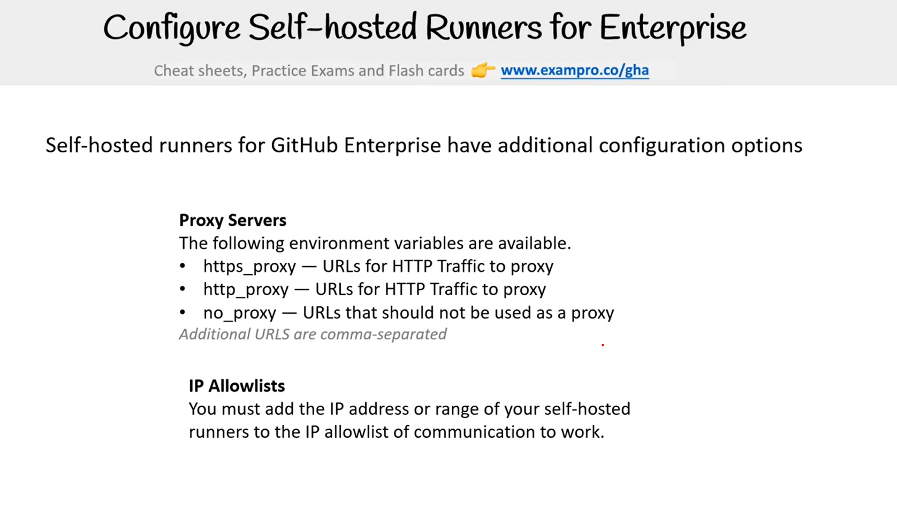

### Structure du répertoire pour une action JavaScript personnalisée

```plaintext
/your-action-name
    /node_modules
    action.yml
    index.js
    package.json
    README.md
```

### Exemple d'action

```yaml
name: "My JavaScript action"
description: "A description of your action"
inputs:
    my-input:
        description: "Input to use in the action"
        required: true
        default: "HPierre"

outputs:
    my-output:
        description: "Output from action"

runs:
    using: "node24"
    main: "index.js"
```

### Exemple de fichier `README.md`

```markdown
# My JavaScript Action

## Description

A description of your action.

## Inputs

### `my-input`

**Required**: true  
**Default**: "HPierre"  
Description: Input to use in the action.

## Outputs

### `my-output`

Description: Output from action.

## Example Usage

```yaml
uses: your-username/your-action-name@v1
with:
  my-input: "Some input value"
```
```

### Exemple de fichier `index.js`

```javascript
const core = require('@actions/core');

try {
  // Récupérer l'entrée
  const myInput = core.getInput('my-input');
  console.log(`Input: ${myInput}`);

  // Définir la sortie
  core.setOutput('my-output', `Hello, ${myInput}!`);
} catch (error) {
  core.setFailed(error.message);
}
```

### Exemple de fichier `package.json`

```json
{
  "name": "your-action-name",
  "version": "1.0.0",
  "description": "A description of your action",
  "main": "index.js",
  "scripts": {
    "test": "echo \"Error: no test specified\" && exit 1"
  },
  "dependencies": {
    "@actions/core": "^1.2.6"
  },
  "author": "Your Name",
  "license": "MIT"
}
```

### Explication des fichiers

- **`action.yml`**: Décrit l'action, ses entrées, ses sorties et comment elle s'exécute.
- **`index.js`**: Contient le code JavaScript de l'action.
- **`package.json`**: Décrit les dépendances et les métadonnées du projet.
- **`README.md`**: Fournit des informations sur l'action, y compris comment l'utiliser.


### Structure du répertoire pour une action Docker personnalisée

```plaintext
/your-action-name
    Dockerfile
    action.yml
    entrypoint.sh
    README.md
```

### Exemple d'action

```yaml
name: "My Docker action"
description: "A description of your action"
inputs:
    my-input:
        description: "Input to use in the action"
        required: true
        default: "HPierre"

outputs:
    my-output:
        description: "Output from action"

runs:
    using: "docker"
    image: "Dockerfile"
    args:
      - my-input
```

### Exemple de fichier `README.md`

```markdown
# My Docker Action

## Description

A description of your action.

## Inputs

### `my-input`

**Required**: true  
**Default**: "HPierre"  
Description: Input to use in the action.

## Outputs

### `my-output`

Description: Output from action.

## Example Usage

```yaml
uses: your-username/your-action-name@v1
with:
  my-input: "Some input value"
```
```

### Exemple de fichier `Dockerfile`

```Dockerfile
# Utiliser l'image officielle de base
FROM alpine:3.12

# Installer les dépendances nécessaires
RUN apk add --no-cache bash curl jq

# Copier le script d'entrée
COPY entrypoint.sh /entrypoint.sh

# Rendre le script exécutable
RUN chmod +x /entrypoint.sh

# Définir le point d'entrée
ENTRYPOINT ["/entrypoint.sh"]
```

### Exemple de fichier `entrypoint.sh`

```bash
#!/bin/bash

set -e

# Récupérer l'entrée
MY_INPUT="$1"
echo "Input: $MY_INPUT"

# Définir la sortie
echo "::set-output name=my-output::Hello, $MY_INPUT!"
```

### Explication des fichiers

- **`action.yml`**: Décrit l'action, ses entrées, ses sorties et comment elle s'exécute.
- **`Dockerfile`**: Définit l'image Docker utilisée pour exécuter l'action.
- **`entrypoint.sh`**: Contient le script d'entrée qui sera exécuté dans le conteneur Docker.
- **`README.md`**: Fournit des informations sur l'action, y compris comment l'utiliser.

### Exemple de fichier `action.yml` en détail

```yaml
name: "My Docker action"
description: "A description of your action"
inputs:
    my-input:
        description: "Input to use in the action"
        required: true
        default: "HPierre"

outputs:
    my-output:
        description: "Output from action"

runs:
    using: "docker"
    image: "Dockerfile"
    args:
      - my-input
```

### Exemple de fichier `README.md` en détail

```markdown
# My Docker Action

## Description

A description of your action.

## Inputs

### `my-input`

**Required**: true  
**Default**: "HPierre"  
Description: Input to use in the action.

## Outputs

### `my-output`

Description: Output from action.

## Example Usage

```yaml
uses: your-username/your-action-name@v1
with:
  my-input: "Some input value"
```
```

### Exemple de fichier `Dockerfile` en détail

```Dockerfile
# Utiliser l'image officielle de base
FROM alpine:3.12

# Installer les dépendances nécessaires
RUN apk add --no-cache bash curl jq

# Copier le script d'entrée
COPY entrypoint.sh /entrypoint.sh

# Rendre le script exécutable
RUN chmod +x /entrypoint.sh

# Définir le point d'entrée
ENTRYPOINT ["/entrypoint.sh"]
```

### Exemple de fichier `entrypoint.sh` en détail

```bash
#!/bin/bash

set -e

# Récupérer l'entrée
MY_INPUT="$1"
echo "Input: $MY_INPUT"

# Définir la sortie
echo "::set-output name=my-output::Hello, $MY_INPUT!"
```

## Configuration d'un self-hosted runner entreprise
